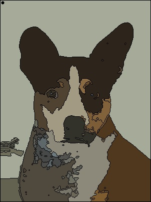

# Udacity C++ Nanodegree Capstone Repo: "Paint By Numbers"


This is my original submission for Udacity's C++ Developer Nanodegree program. A custom class and script take an input image and process it to give it a stylized look, similar to "Paint by numbers" projects. The project uses OpenCV as a backend for the image processing, and can be used for any input image. The output image is saved for future use.

This is based off of the starter repo for the Capstone project in the [Udacity C++ Nanodegree Program](https://www.udacity.com/course/c-plus-plus-nanodegree--nd213).

# Project Organization
This project is organized as follows:
```
CppND-Capstone-Paint-By-Numbers
- build/                      # User-created directory for the build files (described below)
- include/                    # Directory containing 
  - watershed_segmentation.h  # Header file which contains the defined watershed segmentation class
- results/                    # Directory to store resulting images
  - dog.jpg                   # Sample image
  - jedi.jpg                  # Sample image
  - plane.jpg                 # Sample image
  - out.jpg                   # This is where the user-generated image is saved upon completion of the script
- src/                        # Source code directory
  - main.cpp                  # The main script file; handles user inputs, creates & runs the watershed segmenter object, and saves the result
- LICENSE.md                  # License file
- README.md                   # This file, which contains information about the project, plus installation and usage instructions
```


# Installation and usage
## Dependencies for Running Locally
* cmake >= 3.7
  * All OSes: [click here for installation instructions](https://cmake.org/install/)
* make >= 4.1 (Linux, Mac), 3.81 (Windows)
  * Linux: make is installed by default on most Linux distros
  * Mac: [install Xcode command line tools to get make](https://developer.apple.com/xcode/features/)
  * Windows: [Click here for installation instructions](http://gnuwin32.sourceforge.net/packages/make.htm)
* gcc/g++ >= 5.4
  * Linux: gcc / g++ is installed by default on most Linux distros
  * Mac: same deal as make - [install Xcode command line tools](https://developer.apple.com/xcode/features/)
  * Windows: recommend using [MinGW](http://www.mingw.org/)
* OpenCV==4.2
  * Linux
    In a directory of your choice: 
    - `wget -O opencv.zip https://github.com/opencv/opencv/archive/refs/tags/4.2.0.zip`
    - `unzip opencv.zip`
    - `mv opencv-4.2.0/ opencv`
    - `mkdir build && cd build`
    - `cmake ../opencv`
    - `make` (This will take several minutes)
    - `sudo make install`
  * Mac: [Installation instructions](https://www.geeksforgeeks.org/how-to-install-opencv-for-c-on-macos/)
  * Windows: [Installation instructions](https://learnopencv.com/install-opencv-on-windows/)
  * Important note: version 4.2 is required!
  
## Basic Build Instructions

1. Clone this repo: `git clone https://github.com/roboav8r/CppND-Capstone-Paint-By-Numbers.git`
2. Make a build directory in the top level directory: `cd CppND-Capstone-Paint-By-Numbers && mkdir build && cd build`
3. Compile: `cmake .. && make`

## Usage
To use the Paint-by-numbers image segmenter, run the compiled `./PaintByNumbers` binary using one of the methods below.

First, `cd CppNdCppND-Capstone-Paint-By-Numbers/build`

* Using the default values: 
  
  `./PaintByNumbers `

* Using custom parameters:

  `./PaintByNumbers ../data/apache.jpg False 0.3 15 35 3 0.25 0 0.01 0`

  `./PaintByNumbers ../data/blackhawk.jpg False 1.5 15 35 3 1.5 50 0.0275 0`

  `./PaintByNumbers ../data/dog.jpg False 0.1 21 21 3 1.25 0 0.005 0`

  `./PaintByNumbers ../data/f14.jpg False 1.0 21 15 1 1.5 0 0.01 1`

  `./PaintByNumbers ../data/yoda.jpeg False 0.75 30 30 3 1.75 0 0.03 1`

* Or upload your own picture into the `/data` directory and experiment with different processing parameters. In order, the parameters are:

  **Input file path** (string). The file path of the original input image, relative to the `./PaintByNumbers` binary. Example: `../data/my_image.png`

  **Visualization** (boolean). Whether or not to display images at various stages of processing. Uses OpenCV's `imshow` command. Example: `False` or `True`
  
  **Scaling factor** (float)    How much to scale the input image prior to processing. Must be positive. Example: `0.5` scales the input to half its original size.

  **Spatial filtering window** (int), **Color window** (int). Both spatial and coloring window are used for mean-shift filtering. The larger the number, the more noticeable the effect. Example values: `20`, `20`; below `50` is good for an image that's a few hundred pixels wide, and above `100` and the picture gets very distorted.

  **Gaussian blur size** (int).  Dimension of the gaussian smoothing/blur kernel to use. Larger value = more blurred. Example: `3` is a good value to use if the image is a few hundred pixels wide/tall, above `10` and the image gets distinctly blurry.

  **Sharpening coefficient** (float). Strength of the sharpening kernel used to sharpen the image and generate segment edges. `2.0` is a reasonably strong edge, while `0.0` does no sharpening.

  **Binary grayscale threshold** (int). Cutoff for binary grayscale mask. Should be between 0-255, with lower values (e.g. 0, 40) commonly used.  
  
  **Peak threshold** (float). Watershed algorithm peak threshold. Lower values (e.g. .01 - .1) will generate more, smaller segments, while larger values will result in fewer, but larger, segments. Value should be in range (0.0-1.0)

  **Dilation width** (int). How much to dilate each peak found in the watershed algorithm. Smaller values (e.g. 1 for an image 100s of pixels wide) will result in finer lines. Larger values (5+) will result in larger segments.

  For more information on each parameter, see the watershed algorithm tutorials listed in the Credit/Additional Resources section below.

# Rubric 
In addition to the README and Compiling & Testing requirements, this project meets the following guidelines from the rubric:
* Loops, Functions, I/O
  * **The project demonstrates an understanding of C++ functions and control structures**: `for` and `if` control structures are used throughout `include/watershed_segmentation.h`; `main.cpp#27` uses a ternary operator for control; `watershed_segmentation.h` is organized into functions.
  * **The project reads data from a file and process the data, or the program writes data to a file**: `watershed_segmentation.h#57` reads an image from the specified file path; `watershed_segmentation.h#241` saves an image to file.
  * **The project reads data from a file and process the data, or the program writes data to a file**: `./build/PaintByNumbers` can optionally be run with user-specified inputs. They are processed using OpenCV's `cv::CommandLineParser` at `main.cpp#23` according to the key at `main.cpp#6`.

* Object Oriented Programming
  * **The project uses Object Oriented Programming techniques**: This project uses a custom `Segmentation::Watershed` class, defined in `watershed_segmentation.h`; class attributes hold the data and class methods perform operations on the data.
  * **Classes use appropriate access specifiers for class members**: `Segmentation::Watershed`'s public members are defined at `include/watershed_segmentation.h#19-243`, while private members are defined at `include/watershed_segmentation.h#245-259`. A `protected` modifier is included at `include/watershed_segmentation.h#262`, but no protected members were used in this project.
  * **Class constructors utilize member initialization lists**: The default constructer uses a member initialization list for class members at `include/watershed_segmentation.h#25-33`.


# Credit/Additional Resources
This project is based off of the image segmentation tutorials here:
https://anothertechs.com/programming/cpp/opencv/opencv-watershed/
https://docs.opencv.org/4.x/d2/dbd/tutorial_distance_transform.html